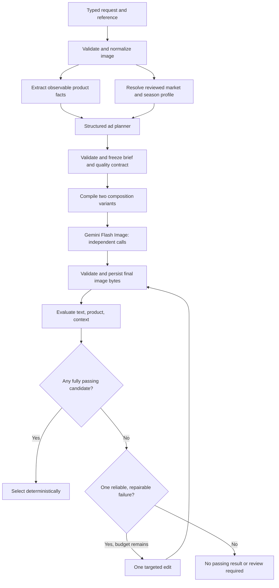

# G2 ad generation — design pack

Version: 0.1 · 2026-09-26 · **Proposed design, not measured results**

Owner: Garmit Pant. Scope of this iteration: image generation pipeline and the contracts needed to connect an evaluator. Implementation happens in a separate repository and with another agent. No paid inference or implementation was performed while preparing this pack.

## Read in order

1. [Pipeline specification](01-generation-pipeline.md) — contracts, flow, prompts, failure handling, persistence, acceptance requirements.
2. [Model decisions and sources](02-model-decisions.md) — researched capabilities, recommendations, costs, unresolved verification.
3. [Challenges and decision record](03-challenges-and-decisions.md) — corrections to the context bank, risks, experiments, next decisions.
4. [Implementation handoff](04-implementation-handoff.md) — staged work for the coding agent and concrete acceptance cases.

The source context is `hackathons/g2-ad-imagegen/{01,02,03,04,05}-*.md`, `README.md`, and `AGENT_BRIEF.md` in GarmitPant/resume-workbench at commit `b937bc4`. All seven files were read. The context bank contains preliminary proposals; this pack explicitly identifies recommended revisions. Organizer requirements and Garmit's subsequent decisions take precedence.

## Core design

The repair edge is traversable only once per request. All provider dispatches share a finite budget. “Passing” means accepted by a versioned evaluator, not guaranteed ground-truth correctness.

## Current proposed defaults

- Python, CLI/library first; one process, local files, no service infrastructure.
- Square 1K images; exact requested headline; one product instance.
- Gemini 3.1 Flash Image for generation and editing; Gemini 3.8 Flash for one cached reference analysis.
- Separate reference-analysis and ad-planning calls to Gemini 3.8 Flash; deterministic validation and prompt compilation surround both.
- Two independent candidates, then at most one repair: at most three image-provider dispatches including resubmissions.
- Model-rendered text only initially; overlays and product compositing are separate, disabled extensions.
- Evaluator: PP-OCRv5 + product detector/embeddings + Claude Sonnet 5 as a provisional context judge. Judge selection remains subject to human-labelled calibration.

## Repository transfer

This design pack now lives in GarmitPant/ad-image-generator-evaluator. The initial context and design were prepared in the resume-workbench workspace; that repository remains the provenance source.

The original context is preserved in `docs/context/`; the reconciled root `AGENTS.md` defines how to use the current design and distinguish proposals from approved decisions. Do not copy the historical `AGENT_BRIEF.md` over it.

## Collaboration record

| Milestone | Human direction | Assistant work | Human changes/approval |
|---|---|---|---|
| Design v0.1 | Read context; research and specify generation first; keep UI secondary; another agent implements; concise chat, detailed artifacts | Read seven context files; verify official model documentation; draft pipeline contracts, model choices, challenges, handoff tests | Awaiting discussion; proposals are not recorded as approved |

Operational context supplied during this iteration: about six hours remain; product photos are being sourced; Gemini billing is not enabled yet; no API budget is approved. The project repository is GarmitPant/ad-image-generator-evaluator. These do not prevent review of this design.

| Follow-up | Human direction | Design response |
|---|---|---|
| Planning stages | Use separate model tasks to interpret inputs, plan the ad and prepare text before image generation | Add a schema-constrained ad planner; reuse the same text/vision model for distinct analysis and planning calls; preserve the supplied ad copy exactly |
