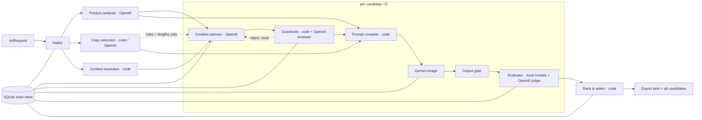

# G2 design pack

Version 0.4 · 2026-09-26 · Generation design confirmed by Garmit; technical details proposed, not measured

This repository holds both design and implementation. Claude Code implements here and keeps checkpoints in [../implementation-status.md](../implementation-status.md).

## Current priorities

1. Generation pipeline: 3 candidates per request (one LLM plan each, simple predefined guardrails, 1–3 references), each evaluated and ranked, best presented, all saved; SQLite state store. Implemented first.
2. Rigorous standalone evaluation: text selection, text rendering, product identity, context adherence and guardrail flags. This is the main judged deliverable.
3. Human-labelled data, targeted failures, offline regression, calibration and reports.
4. Batched evaluation next; repair, ablations and UI only if time remains.

## Read in order

- [Generation pipeline](01-generation-pipeline.md): stages, sub-agents, guardrails, prompt compilation.
- [State store](06-state-store.md): SQLite schema and rules.
- [Evaluation and text contract](05-evaluation-and-text-contract.md): text modes and the evaluator.
- [Implementation handoff](04-implementation-handoff.md): tickets and acceptance tests.
- [Models and source audit](02-model-decisions.md): OpenAI and Gemini roles, spending.
- [Challenges and decision history](03-challenges-and-decisions.md).

## Revision history

- v0.1: generation-first design that preserved the entire input verbatim, with a staged-model proposal.
- v0.2: evaluation made the main focus; Exact/Extract modes; minimal template-based generation.
- v0.3: Garmit confirmed an LLM planner, general guardrails instead of a registry per pair (8-country enum), one replan then flag, a SQLite state store, OpenAI + Gemini only (no Anthropic code), placeholder keys, and generation implemented first.
- v0.4: 3 candidates with one plan each, per-candidate evaluation and code ranking, best presented and all saved, 1–3 references, simplified predefined guardrails, local-only evaluator vision models, batched evaluation next.

Old version details remain in Git history. Source context remains unchanged in `docs/context/`. For confirmed decisions and actual work, see `../decisions.md` and `../agent-collaboration.md`.
