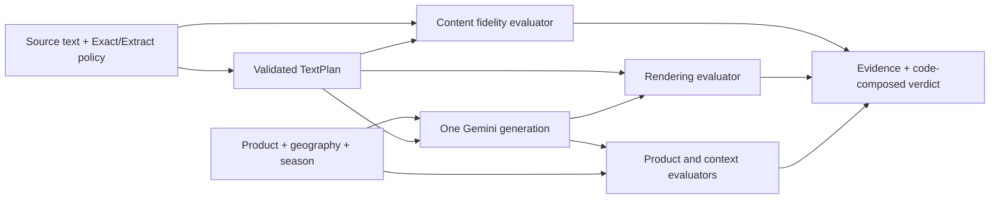

# G2 design pack — evaluation first

Version 0.2 · 2026-09-26 · Requirements clarified; technical methods proposed, not measured

This repository is the project repository for both design and implementation. Another agent implements here. No application code or paid inference was produced during these design updates.

## Current priorities

1. Functional reference-conditioned generation with one image per request.
2. Rigorous standalone evaluation: text selection, text rendering, product identity and context adherence.
3. Human-labelled data, targeted failures, offline regression, calibration and reports.
4. Generation optimization, repair, ablation and UI only if time remains.

## Read in order

- [Evaluation and text contract](05-evaluation-and-text-contract.md) — primary current specification.
- [Functional generation](01-generation-pipeline.md) — minimum baseline that supplies auditable evaluation artifacts.
- [Implementation handoff](04-implementation-handoff.md) — evaluation-first tickets and acceptance tests.
- [Models and source audit](02-model-decisions.md) — researched options, not benchmark claims.
- [Challenges and decision history](03-challenges-and-decisions.md).

The content evaluator checks selection fidelity; the render evaluator checks pixels against the frozen selection. Freeform copy does not set visual art direction. A semantic judge may use raw input to assess content, but the image model receives only selected copy plus the independently resolved scene.

## Revision history

- v0.1: detailed generation-first design, preserving entire input verbatim; original staged-model proposal.
- v0.2: Garmit clarified evaluation is the main engineering focus, the same repository houses implementation, and relevant source content may be extracted. He explicitly selected Exact/Extract modes with optional protected phrases.

Old version details remain in Git history; source context remains unchanged in docs/context/. For confirmed decisions and actual work see ../decisions.md and ../agent-collaboration.md. The prior six-hour estimate was supplied earlier in the conversation; recheck the actual remaining event time before scheduling implementation. Billing, budget and photos were pending at the last update.
