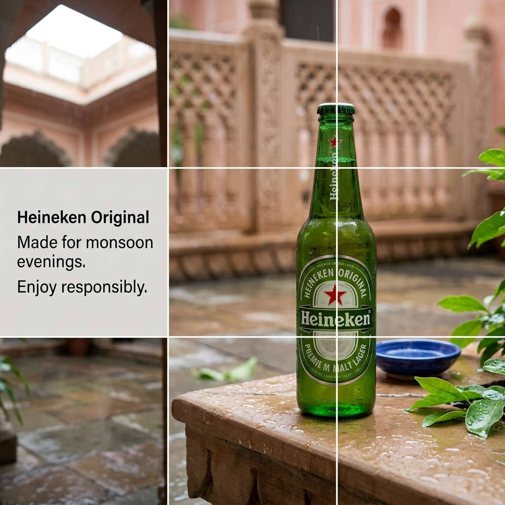

# b1-01-heineken-in-summer-exact · candidate 3

**Verdict: PASS** · score 1.0 · not selected

IN / summer · exact mode · plan guardrails: approved · evaluation ok

## Technical checks: PASS (score 1.0)

| Check | Result | Why |
|---|---|---|
| Image file is readable | PASS | image decodes |
| Square and at most 1024 px | PASS | square and long edge <= 1024 |

## Text selection (input → copy): PASS (score 1.0)

| Check | Result | Why |
|---|---|---|
| Selected copy is an exact excerpt of the input | PASS | every block is an exact, ordered source span |
| Protected phrases kept whole | PASS | protected phrases kept whole |
| Copy fits the ad (max 4 blocks, 120 characters, 20 words) | PASS | within rendering capacity |
| Exact mode: the whole input is the copy | PASS | Exact mode keeps the entire input |
| Exact mode: nothing to select | PASS | Exact mode: the whole input is the copy; no selection to judge |

## Text rendering (copy → image): PASS (score 1.0)

| Check | Result | Why |
|---|---|---|
| Every copy line appears once, spelled exactly | PASS | all 1 copy block(s) found exactly once |
| No duplicated or unplanned text | PASS | no unplanned ad text |
| Text is legible (confidence and size proxy) | PASS | legibility proxy: confident reads and text height >= min_text_height_px (never fails on its own) |

## Product (same object): PASS (score 1.0)

| Check | Result | Why |
|---|---|---|
| Exactly one product visible | PASS | judge counted 1, detector counted 1; exactly one required and both must agree |
| Same type of product | PASS | The final image shows a Heineken beer bottle like the references. |
| Same shape and silhouette | PASS | It has the same capped, long-necked bottle silhouette. |
| Same colours and materials | PASS | The green glass bottle and green, white and red labeling match the references. |
| Distinctive parts preserved | PASS | Red stars appear on the neck and oval front label, with vertical Heineken branding on the neck. |
| Product branding matches the reference | PASS | The bottle label visibly reads Heineken Original and Premium Malt Lager, with smaller Brewed in Holland text. |
| Visual similarity to the reference (diagnostic) | PASS (info) | DINOv2 cosine similarity to the closest reference: 0.8917 |

## Context (country, season, guardrails): PASS (score 1.0)

| Check | Result | Why |
|---|---|---|
| Scene fits the season | PASS | Rain-wet stone and lush green leaves are consistent with India's summer monsoon; nothing visibly contradicts it. |
| No out-of-season elements | PASS | The courtyard is wet with rain, but no snow or frost is visible. |
| Setting plausible for the country | PASS | The courtyard architecture and rainy setting are plausible for India. |
| Country recognisable from the scene (diagnostic) | PASS (info) | The sandstone courtyard, carved jali screens and scalloped arches suggest Indian architecture. |
| No cultural caricature or costume shorthand | PASS | The image shows regional architectural details without depicting or caricaturing people. |
| No flags; landmarks only in the background | PASS | No flags, national emblems or dominant landmarks are visible. |
| No religious imagery | PASS | No religious symbol, ceremony or identifiable religious site is visible. |
| No season contradictions | PASS | The rain-wet courtyard and greenery do not contradict a summer monsoon setting. |
| No real people; no minors with age-restricted products | PASS | No people are visible. |
| Responsible depiction of alcohol | PASS | The bottle is unattended; no drinking, driving, minors or health claims are depicted. |

## Copy: expected vs read by OCR

| Expected | Read in image | Result | Character error rate |
|---|---|---|---|
| `Heineken Original
Made for monsoon evenings.
Enjoy responsibly.` | `Heineken Original Made for monsoon evenings. Enjoy responsibly.` | exact (whitespace-equivalent) | 0.0 |
