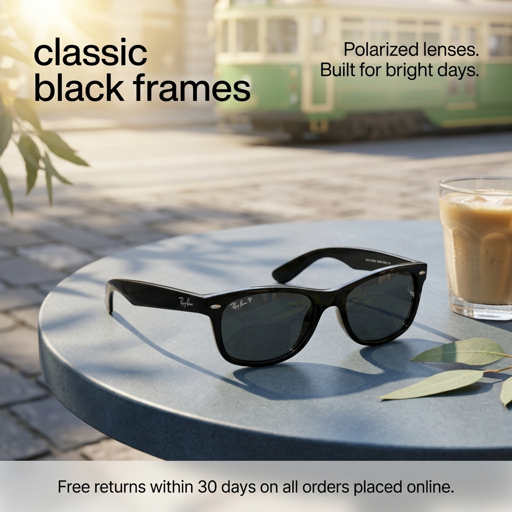

# b1-02-sunglasses-au-summer-extract · candidate 2

**Verdict: PASS** · score 1.0 · **winner** (approved)

AU / summer · extract mode · plan guardrails: approved · evaluation ok

## Technical checks: PASS (score 1.0)

| Check | Result | Why |
|---|---|---|
| Image file is readable | PASS | image decodes |
| Square and at most 1024 px | PASS | square and long edge <= 1024 |

## Text selection (input → copy): PASS (score 1.0)

| Check | Result | Why |
|---|---|---|
| Selected copy is an exact excerpt of the input | PASS | every block is an exact, ordered source span |
| Protected phrases kept whole | PASS | protected phrases kept whole |
| Copy fits the ad (max 4 blocks, 120 characters, 20 words) | PASS | within rendering capacity |
| Meaning preserved (no lost 'not', 'up to' or conditions) | PASS | judge answered yes |
| Nothing essential left out of the copy | PASS | judge answered no |
| Selected copy is relevant to the product or offer | PASS | judge answered yes |

## Text rendering (copy → image): PASS (score 1.0)

| Check | Result | Why |
|---|---|---|
| Every copy line appears once, spelled exactly | PASS | all 3 copy block(s) found exactly once |
| No duplicated or unplanned text | PASS | no unplanned ad text |
| Text is legible (confidence and size proxy) | PASS | legibility proxy: confident reads and text height >= min_text_height_px (never fails on its own) |

## Product (same object): PASS (score 1.0)

| Check | Result | Why |
|---|---|---|
| Exactly one product visible | PASS | judge counted 1, detector counted 1; exactly one required and both must agree |
| Same type of product | PASS | The final image shows the same type of product: sunglasses. |
| Same shape and silhouette | PASS | The rectangular frames and angled temple arms match the reference silhouette. |
| Same colours and materials | PASS | Both have glossy black frames and dark tinted lenses. |
| Distinctive parts preserved | PASS | Two tinted lenses, an integrated bridge, small oval corner accents, and curved temple tips are visible. |
| Product branding matches the reference | PASS | The lens bears a Ray-Ban P mark, and the temple bears Ray-Ban branding. |
| Visual similarity to the reference (diagnostic) | PASS (info) | DINOv2 cosine similarity to the closest reference: 0.9328 |

## Context (country, season, guardrails): PASS (score 1.0)

| Check | Result | Why |
|---|---|---|
| Scene fits the season | PASS | Bright sunshine, leafy greenery, and an iced drink are consistent with an Australian summer; nothing visible contradicts it. |
| No out-of-season elements | PASS | No snow, snowfall, frost, or blizzard is visible. |
| Setting plausible for the country | PASS | The sunny street café setting and tram are plausible in Australia. |
| Country recognisable from the scene (diagnostic) | PASS (info) | The green-and-cream tram is a recognisable Melbourne cue. |
| No cultural caricature or costume shorthand | PASS | No people or caricatures are depicted; the tram is background context. |
| No flags; landmarks only in the background | PASS | No flags or national emblems appear, and the background tram does not dominate the product. |
| No religious imagery | PASS | No religious symbols, sites, or ceremonies are visible. |
| No season contradictions | PASS | The sunlit scene has no visible cue contradicting summer. |
| No real people; no minors with age-restricted products | PASS | No people are visible. |
| Responsible depiction of alcohol | PASS | No alcohol, drinking, minors, or driving activity is shown. |

## Copy: expected vs read by OCR

| Expected | Read in image | Result | Character error rate |
|---|---|---|---|
| `classic black frames` | `classic black frames` | exact (whitespace-equivalent) | 0.0 |
| `Polarized lenses. Built for bright days.` | `Polarized lenses. Built for bright days.` | exact (whitespace-equivalent) | 0.0 |
| `Free returns within 30 days on all orders placed online.` | `Free returns within 30 days on all orders placed online.` | exact (whitespace-equivalent) | 0.0 |
