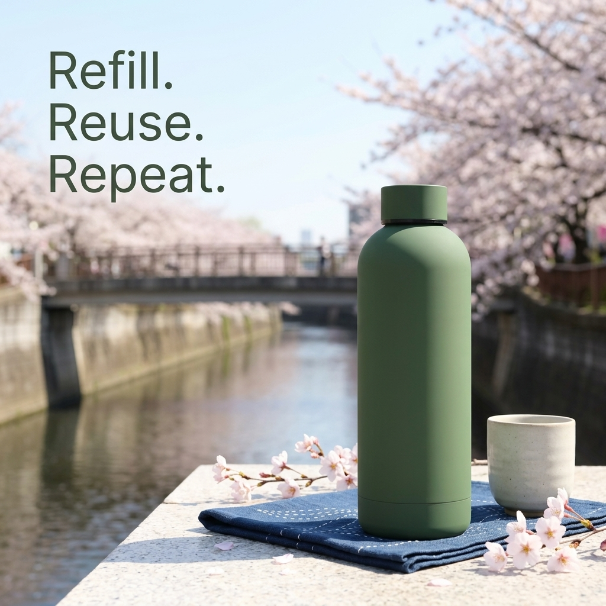

# b1-03-bottle-jp-spring-exact · candidate 3

**Verdict: PASS** · score 1.0 · not selected

JP / spring · exact mode · plan guardrails: approved · evaluation ok

## Technical checks: PASS (score 1.0)

| Check | Result | Why |
|---|---|---|
| Image file is readable | PASS | image decodes |
| Square and at most 1024 px | PASS | square and long edge <= 1024 |

## Text selection (input → copy): PASS (score 1.0)

| Check | Result | Why |
|---|---|---|
| Selected copy is an exact excerpt of the input | PASS | every block is an exact, ordered source span |
| Protected phrases kept whole | PASS | protected phrases kept whole |
| Copy fits the ad (max 4 blocks, 120 characters, 20 words) | PASS | within rendering capacity |
| Exact mode: the whole input is the copy | PASS | Exact mode keeps the entire input |
| Exact mode: nothing to select | PASS | Exact mode: the whole input is the copy; no selection to judge |

## Text rendering (copy → image): PASS (score 1.0)

| Check | Result | Why |
|---|---|---|
| Every copy line appears once, spelled exactly | PASS | all 1 copy block(s) found exactly once |
| No duplicated or unplanned text | PASS | no unplanned ad text |
| Text is legible (confidence and size proxy) | PASS | legibility proxy: confident reads and text height >= min_text_height_px (never fails on its own) |

## Product (same object): PASS (score 1.0)

| Check | Result | Why |
|---|---|---|
| Exactly one product visible | PASS | judge counted 1, detector counted 1; exactly one required and both must agree |
| Same type of product | PASS | The final image shows the same type of reusable bottle. |
| Same shape and silhouette | PASS | It has the same tall cylindrical body, rounded shoulders and short cylindrical cap. |
| Same colours and materials | PASS | The bottle and cap have the reference's matte green appearance. |
| Distinctive parts preserved | PASS | The green cap, narrow dark band below it and faint seam near the bottle's base are visible. |
| Visual similarity to the reference (diagnostic) | PASS (info) | DINOv2 cosine similarity to the closest reference: 0.6099 |

## Context (country, season, guardrails): PASS (score 1.0)

| Check | Result | Why |
|---|---|---|
| Scene fits the season | PASS | The cherry trees are in bloom, consistent with spring; no contradictory seasonal cues are visible. |
| Setting plausible for the country | PASS | The canal, bridge and flowering cherry trees are plausible in Japan. |
| Country recognisable from the scene (diagnostic) | PASS (info) | Cherry blossoms lining an urban canal and pedestrian bridge evoke a Japanese sakura-viewing scene. |
| No cultural caricature or costume shorthand | PASS | No caricature or traditional costume is depicted. |
| No flags; landmarks only in the background | PASS | No flags or national emblems are visible, and no landmark dominates the product. |
| No religious imagery | PASS | No religious symbols, sites or ceremonies are visible. |
| No season contradictions | PASS | Blooming cherry trees support the spring setting. |
| No real people; no minors with age-restricted products | PASS | Any distant figures on the bridge are indistinct and not identifiable. |
| Responsible depiction of alcohol | PASS | No alcohol consumption, driving, minors or health claims are depicted. |

## Copy: expected vs read by OCR

| Expected | Read in image | Result | Character error rate |
|---|---|---|---|
| `Refill. Reuse. Repeat.` | `Refill. Reuse. Repeat.` | exact (whitespace-equivalent) | 0.0 |
