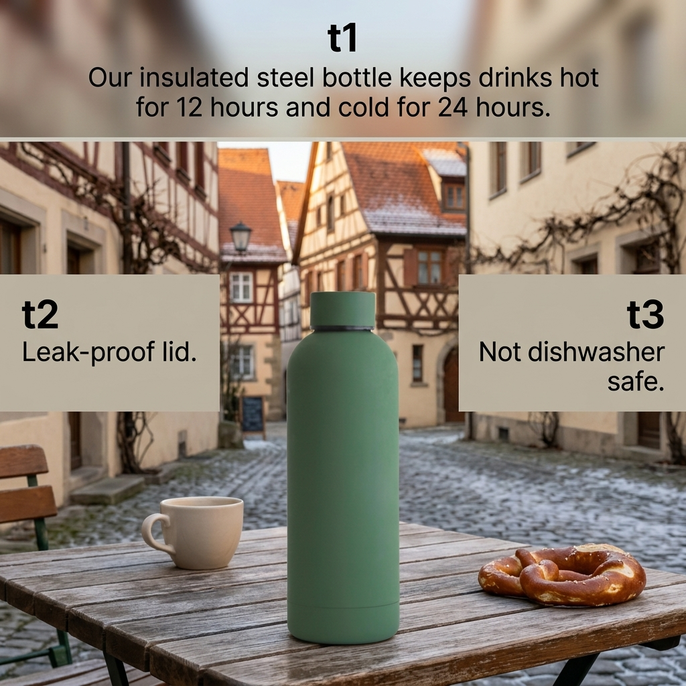

# b1-04-bottle-de-winter-extract · candidate 2

**Verdict: FAIL** · score 1.0 · not selected

DE / winter · extract mode · plan guardrails: approved · evaluation ok

## Technical checks: PASS (score 1.0)

| Check | Result | Why |
|---|---|---|
| Image file is readable | PASS | image decodes |
| Square and at most 1024 px | PASS | square and long edge <= 1024 |

## Text selection (input → copy): PASS (score 1.0)

| Check | Result | Why |
|---|---|---|
| Selected copy is an exact excerpt of the input | PASS | every block is an exact, ordered source span |
| Protected phrases kept whole | PASS | protected phrases kept whole |
| Copy fits the ad (max 4 blocks, 120 characters, 20 words) | PASS | within rendering capacity |
| Meaning preserved (no lost 'not', 'up to' or conditions) | PASS | judge answered yes |
| Nothing essential left out of the copy | PASS | judge answered no |
| Selected copy is relevant to the product or offer | PASS | judge answered yes |

## Text rendering (copy → image): FAIL (score 1.0)

| Check | Result | Why |
|---|---|---|
| Every copy line appears once, spelled exactly | PASS | all 3 copy block(s) found exactly once |
| No duplicated or unplanned text | FAIL | unplanned text: t1; t2; t3 |
| Text is legible (confidence and size proxy) | PASS | legibility proxy: confident reads and text height >= min_text_height_px (never fails on its own) |

## Product (same object): PASS (score 1.0)

| Check | Result | Why |
|---|---|---|
| Exactly one product visible | PASS | judge counted 1, detector counted 1; exactly one required and both must agree |
| Same type of product | PASS | The final image shows an insulated bottle like the reference. |
| Same shape and silhouette | PASS | It has the same tall cylindrical body, rounded shoulders and short cap. |
| Same colours and materials | PASS | The bottle has the same matte green finish and dark band beneath the cap. |
| Distinctive parts preserved | PASS | The matching green cap, narrow dark band and faint seam near the base are visible. |
| Visual similarity to the reference (diagnostic) | PASS (info) | DINOv2 cosine similarity to the closest reference: 0.9734 |

## Context (country, season, guardrails): PASS (score 1.0)

| Check | Result | Why |
|---|---|---|
| Scene fits the season | PASS | Snow on the rooftops and bare vines are consistent with winter; no visible cue contradicts it. |
| Setting plausible for the country | PASS | The half-timbered street scene is plausible for Germany. |
| Country recognisable from the scene (diagnostic) | PASS (info) | Half-timbered buildings, a cobblestone street and a pretzel suggest a German town. |
| No cultural caricature or costume shorthand | PASS | No people or costumes are depicted; the regional cues are architecture and food. |
| No flags; landmarks only in the background | PASS | No flags or national emblems are visible, and no landmark dominates the product. |
| No religious imagery | PASS | No religious symbols, sites or ceremonies are visible. |
| No season contradictions | PASS | Snowy roofs and bare vines support the winter setting. |
| No real people; no minors with age-restricted products | PASS | No people are visible. |
| Responsible depiction of alcohol | PASS | No alcohol consumption, driving or health claim is depicted. |

## Copy: expected vs read by OCR

| Expected | Read in image | Result | Character error rate |
|---|---|---|---|
| `Our insulated steel bottle keeps drinks hot for 12 hours and cold for 24 hours.` | `Our insulated steel bottle keeps drinks hot for 12 hours and cold for 24 hours.` | exact (whitespace-equivalent) | 0.0 |
| `Leak-proof lid.` | `Leak-proof lid.` | exact (whitespace-equivalent) | 0.0 |
| `Not dishwasher safe.` | `Not dishwasher safe.` | exact (whitespace-equivalent) | 0.0 |
