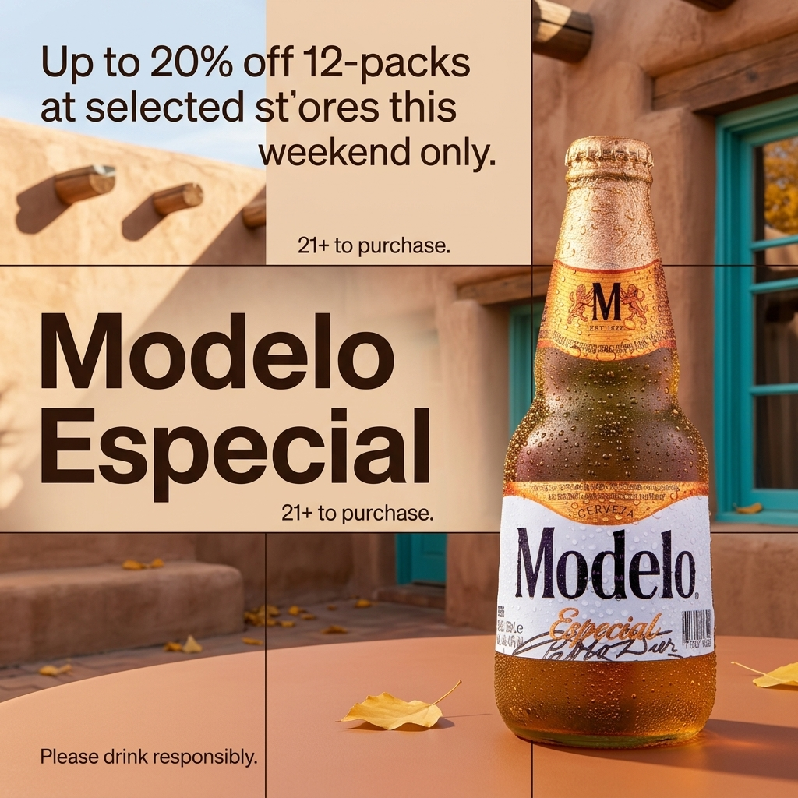

# b1-06-modelo-us-autumn-extract · candidate 3

**Verdict: FAIL** · score 0.9573 · not selected

US / autumn · extract mode · plan guardrails: approved · evaluation ok

## Technical checks: PASS (score 1.0)

| Check | Result | Why |
|---|---|---|
| Image file is readable | PASS | image decodes |
| Square and at most 1024 px | PASS | square and long edge <= 1024 |

## Text selection (input → copy): PASS (score 1.0)

| Check | Result | Why |
|---|---|---|
| Selected copy is an exact excerpt of the input | PASS | every block is an exact, ordered source span |
| Protected phrases kept whole | PASS | protected phrases kept whole |
| Copy fits the ad (max 4 blocks, 120 characters, 20 words) | PASS | within rendering capacity |
| Meaning preserved (no lost 'not', 'up to' or conditions) | PASS | judge answered yes |
| Nothing essential left out of the copy | PASS | judge answered no |
| Selected copy is relevant to the product or offer | PASS | judge answered yes |

## Text rendering (copy → image): FAIL (score 0.9958)

| Check | Result | Why |
|---|---|---|
| Every copy line appears once, spelled exactly | FAIL | expected 'Up to 20% off 12-packs at selected stores this weekend only.', read 'Up to 20% off 12-packs at selected st'ores this weekend only.' (altered) |
| No duplicated or unplanned text | FAIL | duplicated copy: 21+ to purchase. |
| Text is legible (confidence and size proxy) | PASS | legibility proxy: confident reads and text height >= min_text_height_px (never fails on its own) |

## Product (same object): FAIL (score 0.8333)

| Check | Result | Why |
|---|---|---|
| Exactly one product visible | PASS | judge counted 1, detector counted 1; exactly one required and both must agree |
| Same type of product | PASS | The final image shows a Modelo Especial beer bottle. |
| Same shape and silhouette | PASS | It has the reference bottle’s narrow neck, rounded shoulders, and broad body. |
| Same colours and materials | PASS | The amber bottle, gold neck wrap and cap, and white front label match. |
| Distinctive parts preserved | PASS | Droplets, the M-and-lions neck wrap, Modelo label, crimped gold cap, and lower-label barcode are visible. |
| Product branding matches the reference | FAIL | Modelo, Especial, and CERVEZA are visible, but the small neck date appears to read “EST. 1922,” not “EST. 1925.” |
| Visual similarity to the reference (diagnostic) | PASS (info) | DINOv2 cosine similarity to the closest reference: 0.9048 |

## Context (country, season, guardrails): PASS (score 1.0)

| Check | Result | Why |
|---|---|---|
| Scene fits the season | PASS | Yellow fallen leaves and warm light are consistent with autumn; nothing visible contradicts it. |
| Setting plausible for the country | PASS | The courtyard and adobe-style building are plausible in the United States. |
| Country recognisable from the scene (diagnostic) | PASS (info) | Adobe-style walls and turquoise-painted window frames suggest the American Southwest. |
| No cultural caricature or costume shorthand | PASS | No people or caricatures appear; the regional architecture is background context. |
| No flags; landmarks only in the background | PASS | No flags, national emblems, or dominant landmarks are visible. |
| No religious imagery | PASS | No religious symbols, sites, or ceremonies are visible. |
| No season contradictions | PASS | The fallen yellow leaves support, rather than contradict, an autumn scene. |
| No real people; no minors with age-restricted products | PASS | No people are visible. |
| Responsible depiction of alcohol | PASS | The beer bottle is unattended; no minors, driving, excessive drinking, or health claims are depicted. |

## Copy: expected vs read by OCR

| Expected | Read in image | Result | Character error rate |
|---|---|---|---|
| `Modelo Especial` | `Modelo Especial` | exact (whitespace-equivalent) | 0.0 |
| `Up to 20% off 12-packs at selected stores this weekend only.` | `Up to 20% off 12-packs at selected st'ores this weekend only.` | altered | 0.0167 |
| `21+ to purchase.` | `21+ to purchase.` | exact (whitespace-equivalent) | 0.0 |
| `Please drink responsibly.` | `Please drink responsibly.` | exact (whitespace-equivalent) | 0.0 |
