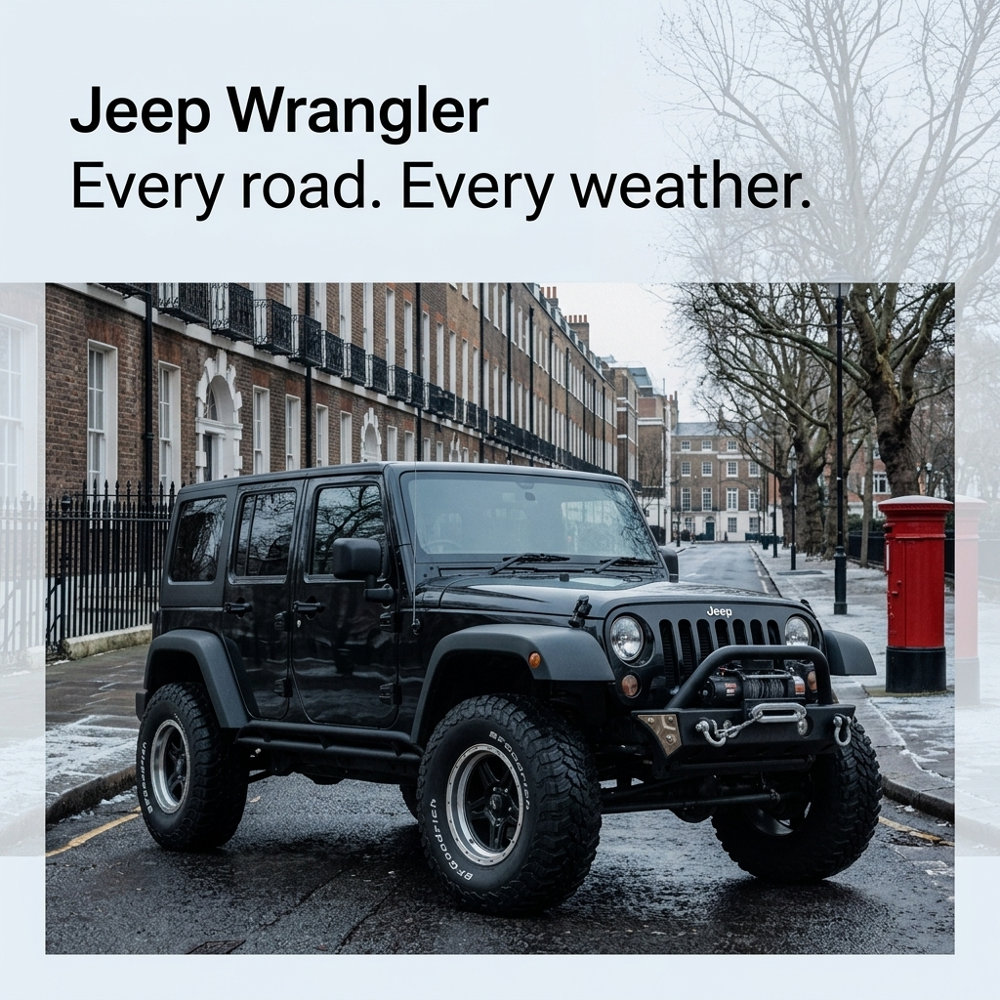

# b1-07-jeep-gb-winter-exact · candidate 1

**Verdict: PASS** · score 1.0 · **winner** (approved)

GB / winter · exact mode · plan guardrails: approved · evaluation ok

## Technical checks: PASS (score 1.0)

| Check | Result | Why |
|---|---|---|
| Image file is readable | PASS | image decodes |
| Square and at most 1024 px | PASS | square and long edge <= 1024 |

## Text selection (input → copy): PASS (score 1.0)

| Check | Result | Why |
|---|---|---|
| Selected copy is an exact excerpt of the input | PASS | every block is an exact, ordered source span |
| Protected phrases kept whole | PASS | protected phrases kept whole |
| Copy fits the ad (max 4 blocks, 120 characters, 20 words) | PASS | within rendering capacity |
| Exact mode: the whole input is the copy | PASS | Exact mode keeps the entire input |
| Exact mode: nothing to select | PASS | Exact mode: the whole input is the copy; no selection to judge |

## Text rendering (copy → image): PASS (score 1.0)

| Check | Result | Why |
|---|---|---|
| Every copy line appears once, spelled exactly | PASS | all 1 copy block(s) found exactly once |
| No duplicated or unplanned text | PASS | no unplanned ad text |
| Text is legible (confidence and size proxy) | PASS | legibility proxy: confident reads and text height >= min_text_height_px (never fails on its own) |

## Product (same object): PASS (score 1.0)

| Check | Result | Why |
|---|---|---|
| Exactly one product visible | PASS | judge counted 1, detector counted 1; exactly one required and both must agree |
| Same type of product | PASS | The vehicle is a four-door Jeep Wrangler-style off-road SUV. |
| Same shape and silhouette | PASS | Its boxy body, upright windscreen, exposed fenders and lifted stance match the references. |
| Same colours and materials | PASS | It has the same dark bodywork, black trim and large rubber off-road tyres. |
| Distinctive parts preserved | PASS | The seven-slot grille, round headlights, four side doors, exposed hinges, large tyres and side rail are visible; the rear spare-tire area is out of view. |
| Product branding matches the reference | PASS | “Jeep” is legible above the grille, and “BFGoodrich” is visible on the front tyre. |
| Visual similarity to the reference (diagnostic) | PASS (info) | DINOv2 cosine similarity to the closest reference: 0.9056 |

## Context (country, season, guardrails): PASS (score 1.0)

| Check | Result | Why |
|---|---|---|
| Scene fits the season | PASS | Bare trees, a damp road and light snow along the pavement are consistent with winter. |
| Setting plausible for the country | PASS | The terraced street, railings and postbox form a plausible UK setting. |
| Country recognisable from the scene (diagnostic) | PASS (info) | A red pillar postbox, brick terraces and black iron railings are recognisable UK street cues. |
| No cultural caricature or costume shorthand | PASS | No people or caricatures are depicted. |
| No flags; landmarks only in the background | PASS | No flags or visible national emblems appear, and no landmark dominates the vehicle. |
| No religious imagery | PASS | No religious symbols, sites or ceremonies are visible. |
| No season contradictions | PASS | The bare trees and traces of snow do not contradict a winter scene. |
| No real people; no minors with age-restricted products | PASS | No people are visible. |
| Responsible depiction of alcohol | PASS | No alcohol or drinking is visible. |

## Copy: expected vs read by OCR

| Expected | Read in image | Result | Character error rate |
|---|---|---|---|
| `Jeep Wrangler
Every road. Every weather.` | `Jeep Wrangler Every road. Every weather.` | exact (whitespace-equivalent) | 0.0 |
