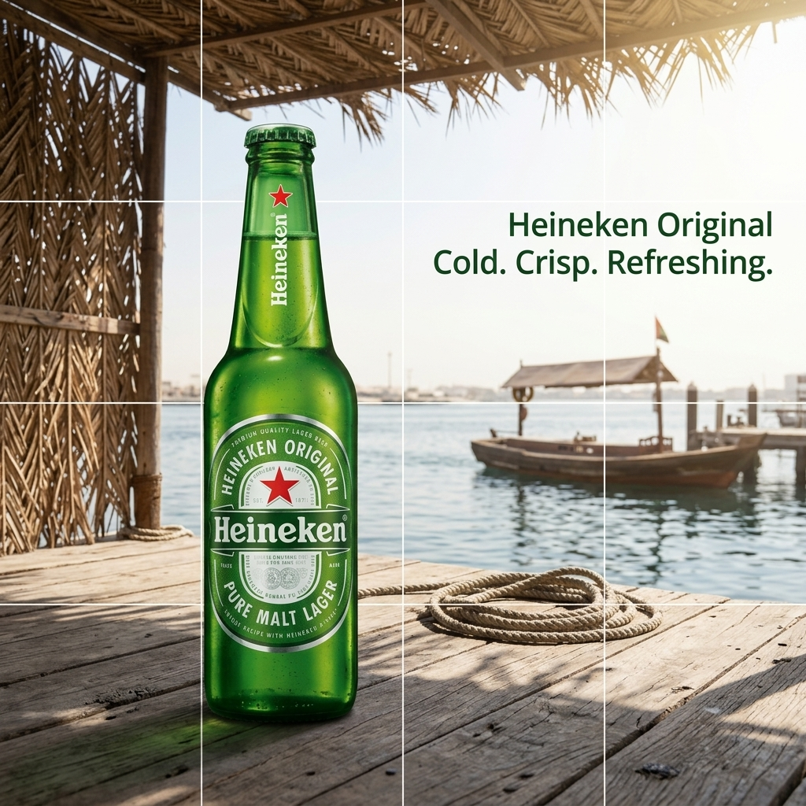

# b1-12-heineken-ae-summer-exact · candidate 3

**Verdict: FAIL** · score 0.9722 · not selected

AE / summer · exact mode · plan guardrails: approved · evaluation ok

## Technical checks: PASS (score 1.0)

| Check | Result | Why |
|---|---|---|
| Image file is readable | PASS | image decodes |
| Square and at most 1024 px | PASS | square and long edge <= 1024 |

## Text selection (input → copy): PASS (score 1.0)

| Check | Result | Why |
|---|---|---|
| Selected copy is an exact excerpt of the input | PASS | every block is an exact, ordered source span |
| Protected phrases kept whole | PASS | protected phrases kept whole |
| Copy fits the ad (max 4 blocks, 120 characters, 20 words) | PASS | within rendering capacity |
| Exact mode: the whole input is the copy | PASS | Exact mode keeps the entire input |
| Exact mode: nothing to select | PASS | Exact mode: the whole input is the copy; no selection to judge |

## Text rendering (copy → image): PASS (score 1.0)

| Check | Result | Why |
|---|---|---|
| Every copy line appears once, spelled exactly | PASS | all 1 copy block(s) found exactly once |
| No duplicated or unplanned text | PASS | no unplanned ad text |
| Text is legible (confidence and size proxy) | PASS | legibility proxy: confident reads and text height >= min_text_height_px (never fails on its own) |

## Product (same object): PASS (score 1.0)

| Check | Result | Why |
|---|---|---|
| Exactly one product visible | PASS | judge counted 1, detector counted 1; exactly one required and both must agree |
| Same type of product | PASS | The final image shows a Heineken lager bottle like the references. |
| Same shape and silhouette | PASS | It has the same capped, long-necked glass-bottle silhouette. |
| Same colours and materials | PASS | The green glass and green, white, and red labeling match the references. |
| Distinctive parts preserved | PASS | Red stars appear on the neck and oval front label, with vertical Heineken branding on the neck. |
| Product branding matches the reference | PASS | The legible main label reads Heineken Original and Pure Malt Lager; the smallest label text is unclear. |
| Visual similarity to the reference (diagnostic) | PASS (info) | DINOv2 cosine similarity to the closest reference: 0.8981 |

## Context (country, season, guardrails): FAIL (score 0.8889)

| Check | Result | Why |
|---|---|---|
| Scene fits the season | PASS | Bright sun and an open waterfront are consistent with a UAE summer; no conflicting seasonal cue is visible. |
| No out-of-season elements | PASS | No snow, frost, or snowfall is visible. |
| Setting plausible for the country | PASS | The shaded waterfront, wooden boat, and palm-thatch shelter are plausible in the UAE. |
| Country recognisable from the scene (diagnostic) | FAIL (info) | The dhow-style boat and palm-thatch shelter suggest a Gulf waterfront, but no visible cue specifically identifies the UAE. |
| No cultural caricature or costume shorthand | PASS | No people or traditional costumes are depicted. |
| No flags; landmarks only in the background | FAIL | A small triangular pennant is visible on the background boat's mast. |
| No religious imagery | PASS | No religious symbols, sites, or ceremonies are visible. |
| No season contradictions | PASS | The sunny scene has no visible cue contradicting summer. |
| No real people; no minors with age-restricted products | PASS | No people are visible. |
| Responsible depiction of alcohol | PASS | The bottle is displayed alone; no people, driving, or drinking are shown. |

## Copy: expected vs read by OCR

| Expected | Read in image | Result | Character error rate |
|---|---|---|---|
| `Heineken Original
Cold. Crisp. Refreshing.` | `Heineken Original Cold. Crisp. Refreshing.` | exact (whitespace-equivalent) | 0.0 |
