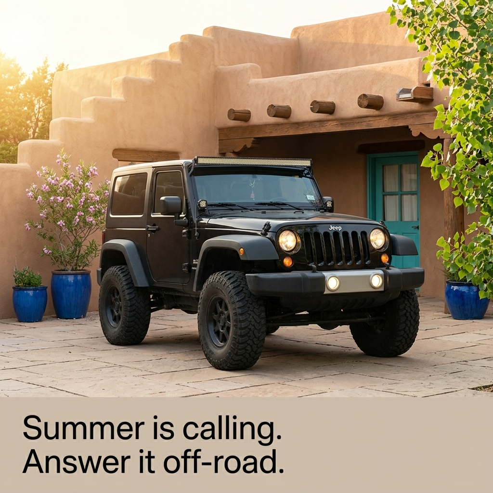

# b1-18-jeep-us-summer-exact · candidate 1

**Verdict: UNSURE** · score 0.9792 · **winner** (not approved)

US / summer · exact mode · plan guardrails: approved · evaluation ok

## Technical checks: PASS (score 1.0)

| Check | Result | Why |
|---|---|---|
| Image file is readable | PASS | image decodes |
| Square and at most 1024 px | PASS | square and long edge <= 1024 |

## Text selection (input → copy): PASS (score 1.0)

| Check | Result | Why |
|---|---|---|
| Selected copy is an exact excerpt of the input | PASS | every block is an exact, ordered source span |
| Protected phrases kept whole | PASS | protected phrases kept whole |
| Copy fits the ad (max 4 blocks, 120 characters, 20 words) | PASS | within rendering capacity |
| Exact mode: the whole input is the copy | PASS | Exact mode keeps the entire input |
| Exact mode: nothing to select | PASS | Exact mode: the whole input is the copy; no selection to judge |

## Text rendering (copy → image): PASS (score 1.0)

| Check | Result | Why |
|---|---|---|
| Every copy line appears once, spelled exactly | PASS | all 1 copy block(s) found exactly once |
| No duplicated or unplanned text | PASS | no unplanned ad text |
| Text is legible (confidence and size proxy) | PASS | legibility proxy: confident reads and text height >= min_text_height_px (never fails on its own) |

## Product (same object): UNSURE (score 0.9167)

| Check | Result | Why |
|---|---|---|
| Exactly one product visible | PASS | judge counted 1, detector counted 1; exactly one required and both must agree |
| Same type of product | PASS | The final image shows a black two-door Jeep off-road vehicle like the reference. |
| Same shape and silhouette | PASS | Its boxy body, high stance, and front-end silhouette match the reference. |
| Same colours and materials | PASS | It retains the dark body, dark trim, and black off-road tires. |
| Distinctive parts preserved | UNSURE | no answer/abstained |
| Product branding matches the reference | PASS | The Jeep badge is legible above the grille. |
| Visual similarity to the reference (diagnostic) | PASS (info) | DINOv2 cosine similarity to the closest reference: 0.8903 |

## Context (country, season, guardrails): PASS (score 1.0)

| Check | Result | Why |
|---|---|---|
| Scene fits the season | PASS | Green foliage, flowers, and a sunlit, snow-free courtyard are consistent with summer. |
| No out-of-season elements | PASS | No snow, frost, or snowfall is visible. |
| Setting plausible for the country | PASS | The southwestern-style courtyard is plausible in the United States; nothing visible clearly contradicts it. |
| Country recognisable from the scene (diagnostic) | PASS (info) | The adobe-style building, turquoise door, and courtyard suggest the southwestern United States. |
| No cultural caricature or costume shorthand | PASS | No people or caricatures are depicted; the regional cues are architectural and decorative. |
| No flags; landmarks only in the background | PASS | No flags or national emblems are visible, and no landmark dominates the product. |
| No religious imagery | PASS | No clear religious symbols, sites, or ceremonies are visible. |
| No season contradictions | PASS | The greenery and snow-free setting do not contradict summer. |
| No real people; no minors with age-restricted products | PASS | No people are visible. |
| Responsible depiction of alcohol | PASS | No alcohol or drinking is visible. |

## Copy: expected vs read by OCR

| Expected | Read in image | Result | Character error rate |
|---|---|---|---|
| `Summer is calling.
Answer it off-road.` | `Summer is calling. Answer it off-road.` | exact (whitespace-equivalent) | 0.0 |
