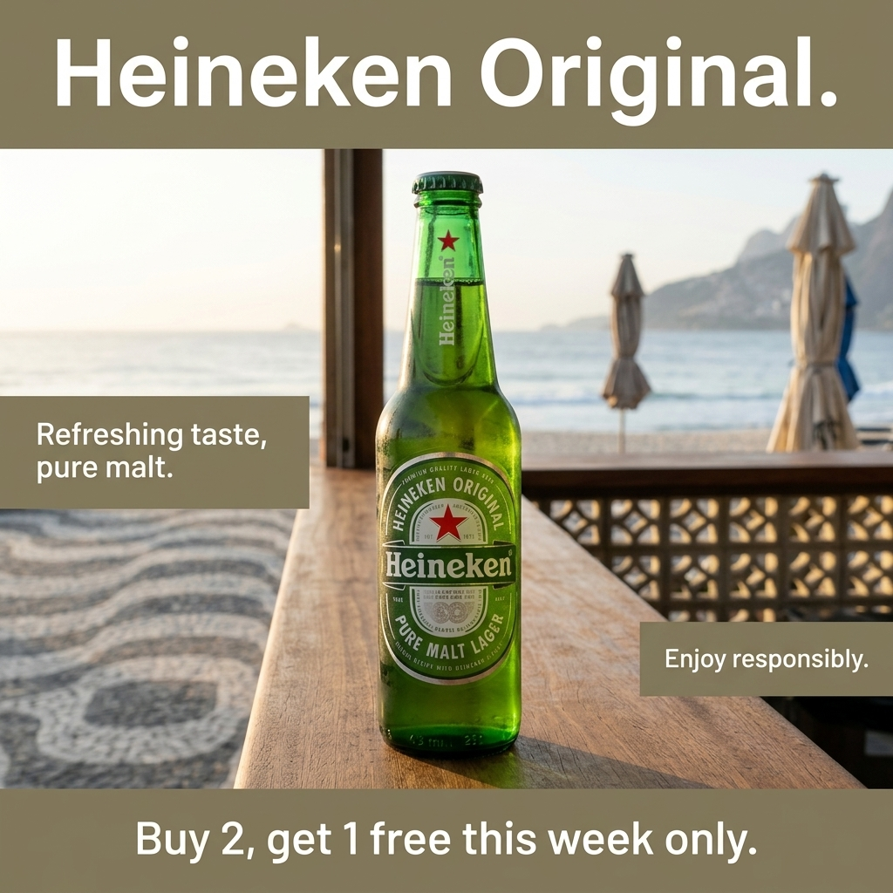

# b1-20-heineken-br-winter-extract · candidate 1

**Verdict: PASS** · score 1.0 · not selected

BR / winter · extract mode · plan guardrails: approved · evaluation ok

## Technical checks: PASS (score 1.0)

| Check | Result | Why |
|---|---|---|
| Image file is readable | PASS | image decodes |
| Square and at most 1024 px | PASS | square and long edge <= 1024 |

## Text selection (input → copy): PASS (score 1.0)

| Check | Result | Why |
|---|---|---|
| Selected copy is an exact excerpt of the input | PASS | every block is an exact, ordered source span |
| Protected phrases kept whole | PASS | protected phrases kept whole |
| Copy fits the ad (max 4 blocks, 120 characters, 20 words) | PASS | within rendering capacity |
| Meaning preserved (no lost 'not', 'up to' or conditions) | PASS | judge answered yes |
| Nothing essential left out of the copy | PASS | judge answered no |
| Selected copy is relevant to the product or offer | PASS | judge answered yes |

## Text rendering (copy → image): PASS (score 1.0)

| Check | Result | Why |
|---|---|---|
| Every copy line appears once, spelled exactly | PASS | all 4 copy block(s) found exactly once |
| No duplicated or unplanned text | PASS | no unplanned ad text |
| Text is legible (confidence and size proxy) | PASS | legibility proxy: confident reads and text height >= min_text_height_px (never fails on its own) |

## Product (same object): PASS (score 1.0)

| Check | Result | Why |
|---|---|---|
| Exactly one product visible | PASS | judge counted 1, detector counted 1; exactly one required and both must agree |
| Same type of product | PASS | The image shows a Heineken beer bottle like the references. |
| Same shape and silhouette | PASS | It has the same long neck, rounded shoulders, and cylindrical bottle silhouette. |
| Same colours and materials | PASS | The bottle is green glass with a green cap and a green, white, and red label. |
| Distinctive parts preserved | PASS | Red stars appear on the neck and large oval front label, with vertical Heineken branding on the neck. |
| Product branding matches the reference | PASS | The bottle label visibly reads Heineken, Heineken Original, and Pure Malt Lager; finer print is too small to verify. |
| Visual similarity to the reference (diagnostic) | PASS (info) | DINOv2 cosine similarity to the closest reference: 0.9096 |

## Context (country, season, guardrails): PASS (score 1.0)

| Check | Result | Why |
|---|---|---|
| Scene fits the season | PASS | The mild-looking coastal scene and closed beach umbrellas do not contradict a Brazilian winter. |
| No out-of-season elements | PASS | No snow, snowfall, frost, or blizzard is visible. |
| Setting plausible for the country | PASS | The beachfront, patterned promenade, and coastal hills are plausible in Brazil. |
| Country recognisable from the scene (diagnostic) | PASS (info) | The black-and-white wave-pattern pavement resembles Rio de Janeiro’s Copacabana promenade, beside a beach and coastal hills. |
| No cultural caricature or costume shorthand | PASS | No people or caricatures appear; the regional cues are the promenade and coastal setting. |
| No flags; landmarks only in the background | PASS | No flag or national emblem is visible, and no landmark dominates the bottle. |
| No religious imagery | PASS | No religious symbols, sites, or ceremonies are visible. |
| No season contradictions | PASS | Nothing in the mild coastal scene clearly contradicts winter in Brazil. |
| No real people; no minors with age-restricted products | PASS | No people are visible. |
| Responsible depiction of alcohol | PASS | Only a beer bottle is shown; there are no people, vehicles, or drinking activity. |

## Copy: expected vs read by OCR

| Expected | Read in image | Result | Character error rate |
|---|---|---|---|
| `Heineken Original.` | `Heineken Original.` | exact (whitespace-equivalent) | 0.0 |
| `Refreshing taste, pure malt.` | `Refreshing taste, pure malt.` | exact (whitespace-equivalent) | 0.0 |
| `Buy 2, get 1 free this week only.` | `Buy 2, get 1 free this week only.` | exact (whitespace-equivalent) | 0.0 |
| `Enjoy responsibly.` | `Enjoy responsibly.` | exact (whitespace-equivalent) | 0.0 |
