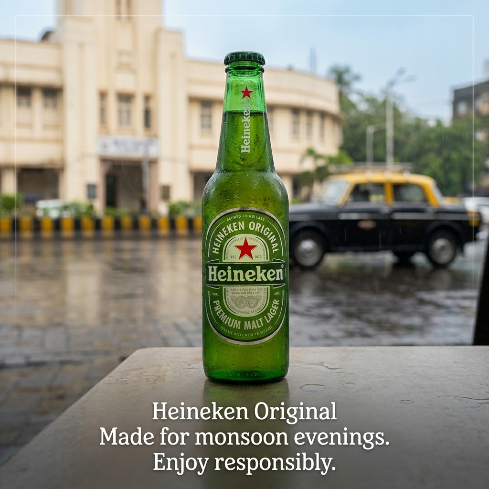
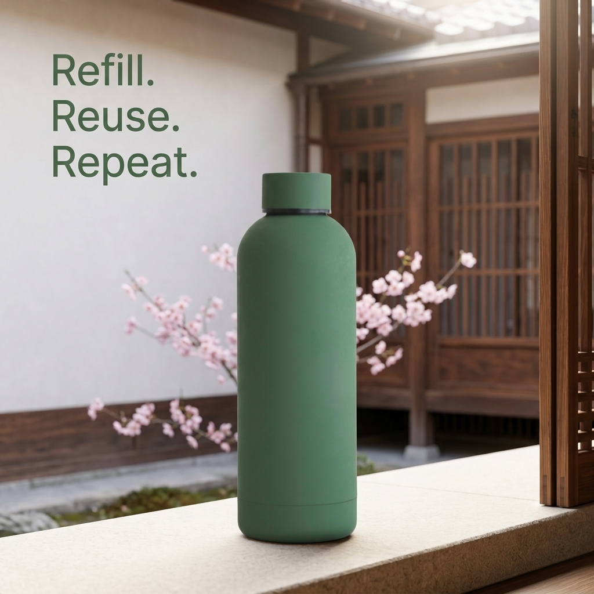
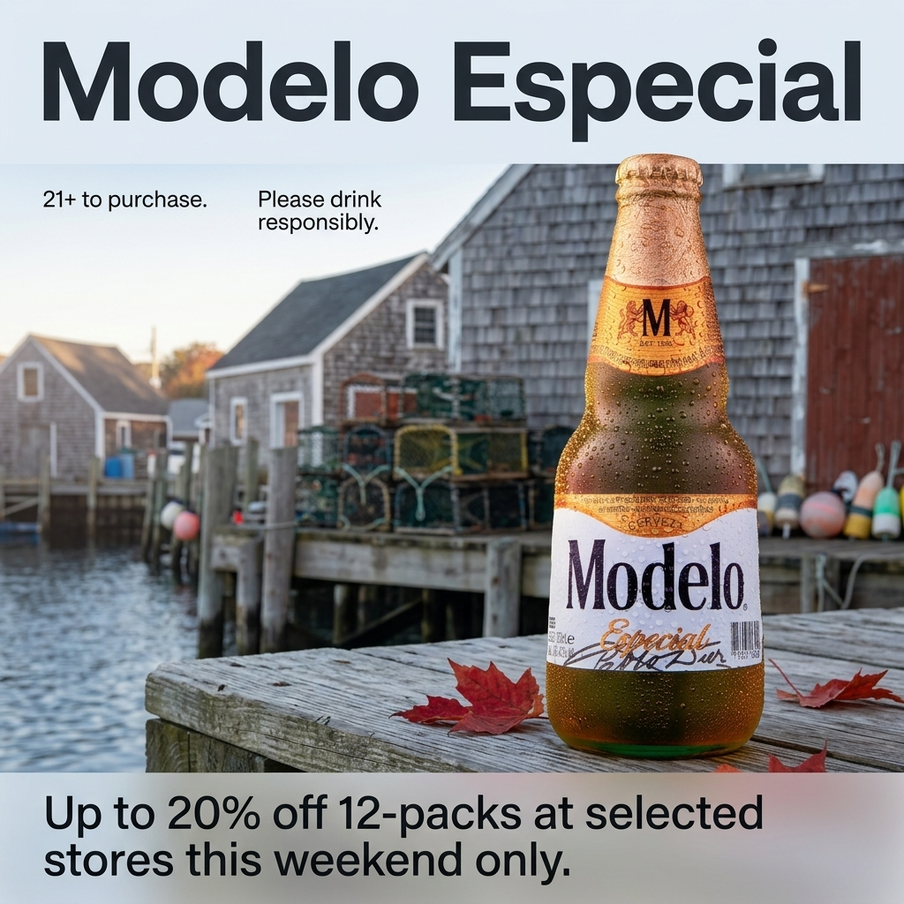

# Evaluation report: generated display ads

_Generated by `adgen report` from the pipeline's state store. Every number is computed from `results.json`; nothing is hand-edited. Per-candidate details: `evidence/*.md`. Visual overview: `contact-sheet.html`._

## 1. Summary

| | |
|---|---|
| Requests / candidates / evaluated | 9 / 27 / 27 |
| Requests whose winner is **approved** (passes every required check) | 8 / 9 |
| Candidates passing every required check | 20 / 27 |
| Country recognisable from the scene (diagnostic) | PASS 23 · FAIL 3 · UNSURE 1 |
| Plan guardrail outcomes | approved 27 |
| Evaluation completeness | ok 27 |
| Median seconds per candidate: generation / evaluation | 34.01 / 22.54 |
| Estimated cost USD: generation / evaluation judge / shared per request | 2.349 / 0.445 / 0.08 |

## 2. How each ad is judged

Each candidate gets PASS, FAIL or UNSURE per dimension. A candidate **passes** only if every required check passes. A single failed check fails it, and an unresolved check makes it UNSURE. Missing evidence never counts as a pass. The code makes these decisions; the AI models only supply measurements (OCR text, detections, similarity) or yes/no answers to single, specific questions.

| Dimension | What is checked | How |
|---|---|---|
| Text selection (input → copy) | Copy is an exact excerpt; protected phrases intact; fits the ad; in Extract mode, meaning kept and nothing essential dropped | Code re-verification; AI judge (its FAIL counts only if it quotes the input) |
| Text rendering (copy → image) | Each copy line appears once, spelled exactly; no duplicated or extra text; legible | OCR reads the image **without** being told the expected text; text on the product itself is ignored |
| Product (same object) | Exactly one product; same type, shape, colours, distinctive parts, branding | AI judge compares references with the ad; object detector used to crop and count; position and angle are not judged |
| Context (country, season, guardrails) | Season fits; nothing out of season; plausible for the country; no flags, caricature, religious imagery or irresponsible alcohol depiction | Same judge call; criteria come from the country/season inputs and the fixed policy, never from the generator's own plan |

Scores (0–1) only break ties between candidates: a higher score never beats a failed check. Ranking: verdict → fewer failed checks → score → country recognisable → product similarity to the reference → plan guardrail outcome → candidate number. The two diagnostics only break ties; they never override a verdict.

## 3. Results

| Dimension | PASS | FAIL | UNSURE |
|---|---|---|---|
| Text selection (input → copy) | 27 | 0 | 0 |
| Text rendering (copy → image) | 25 | 2 | 0 |
| Product (same object) | 22 | 1 | 4 |
| Context (country, season, guardrails) | 26 | 1 | 0 |
| **Overall** | 20 | 3 | 4 |

Most common failure reasons:

| Check | Candidates failing |
|---|---|
| No duplicated or unplanned text | 2 |
| Every copy line appears once, spelled exactly | 1 |
| Product branding matches the reference | 1 |
| No flags; landmarks only in the background | 1 |

## 4. Per request

### b1-01-heineken-in-summer-exact

Beer (alcoholic lager) · **IN / summer** · exact mode · copy: `Heineken Original
Made for monsoon evenings.
Enjoy responsibly.`

| Rank | Candidate | Verdict | Score | Country recognisable | Product similarity | Why |
|---|---|---|---|---|---|---|
| 1 | 1 | PASS | 1.0 | PASS | 0.892 | all required checks passed |
| 2 | 3 | PASS | 1.0 | PASS | 0.8917 | all required checks passed |
| 3 | 2 | PASS | 1.0 | PASS | 0.8636 | all required checks passed |

Winner (candidate 1, approved):

### b1-02-sunglasses-au-summer-extract

Sunglasses · **AU / summer** · extract mode · copy: `classic black frames` / `Polarized lenses. Built for bright days.` / `Free returns within 30 days on all orders placed online.`

| Rank | Candidate | Verdict | Score | Country recognisable | Product similarity | Why |
|---|---|---|---|---|---|---|
| 1 | 2 | PASS | 1.0 | PASS | 0.9328 | all required checks passed |
| 2 | 3 | PASS | 1.0 | PASS | 0.887 | all required checks passed |
| 3 | 1 | PASS | 1.0 | FAIL | 0.9697 | all required checks passed |

Winner (candidate 2, approved):

### b1-03-bottle-jp-spring-exact

Reusable bottle · **JP / spring** · exact mode · copy: `Refill. Reuse. Repeat.`

| Rank | Candidate | Verdict | Score | Country recognisable | Product similarity | Why |
|---|---|---|---|---|---|---|
| 1 | 1 | PASS | 1.0 | PASS | 0.9538 | all required checks passed |
| 2 | 2 | PASS | 1.0 | PASS | 0.8293 | all required checks passed |
| 3 | 3 | PASS | 1.0 | PASS | 0.6099 | all required checks passed |

Winner (candidate 1, approved):

### b1-04-bottle-de-winter-extract

Reusable bottle · **DE / winter** · extract mode · copy: `Our insulated steel bottle keeps drinks hot for 12 hours and cold for 24 hours.` / `Leak-proof lid.` / `Not dishwasher safe.`

| Rank | Candidate | Verdict | Score | Country recognisable | Product similarity | Why |
|---|---|---|---|---|---|---|
| 1 | 3 | PASS | 1.0 | PASS | 0.8275 | all required checks passed |
| 2 | 1 | PASS | 1.0 | PASS | 0.5683 | all required checks passed |
| 3 | 2 | FAIL | 1.0 | PASS | 0.9734 | No duplicated or unplanned text: unplanned text: t1; t2; t3 |

Winner (candidate 3, approved):

### b1-06-modelo-us-autumn-extract

Beer · **US / autumn** · extract mode · copy: `Modelo Especial` / `Up to 20% off 12-packs at selected stores this weekend only.` / `21+ to purchase.` / `Please drink responsibly.`

| Rank | Candidate | Verdict | Score | Country recognisable | Product similarity | Why |
|---|---|---|---|---|---|---|
| 1 | 2 | PASS | 1.0 | PASS | 0.8944 | all required checks passed |
| 2 | 1 | PASS | 1.0 | PASS | 0.8675 | all required checks passed |
| 3 | 3 | FAIL | 0.9573 | PASS | 0.9048 | Every copy line appears once, spelled exactly: expected 'Up to 20% off 12-packs at selected stores this weekend only.', read 'Up to 20% off 12-packs at selected st'ores this weekend only.' (altered); No duplicated or unplanned text: duplicated copy: 21+ to purchase.; Product branding matches the reference: Modelo, Especial, and CERVEZA are visible, but the small neck date appears to read “EST. 1922,” not “EST. 1925.” |

Winner (candidate 2, approved):

### b1-07-jeep-gb-winter-exact

Four-door off-road SUV · **GB / winter** · exact mode · copy: `Jeep Wrangler
Every road. Every weather.`

| Rank | Candidate | Verdict | Score | Country recognisable | Product similarity | Why |
|---|---|---|---|---|---|---|
| 1 | 1 | PASS | 1.0 | PASS | 0.9056 | all required checks passed |
| 2 | 2 | PASS | 1.0 | PASS | 0.9 | all required checks passed |
| 3 | 3 | UNSURE | 0.9792 | PASS | 0.8541 | unsure: Distinctive parts preserved: no answer/abstained |

Winner (candidate 1, approved):

### b1-12-heineken-ae-summer-exact

Beer (alcoholic lager) · **AE / summer** · exact mode · copy: `Heineken Original
Cold. Crisp. Refreshing.`

| Rank | Candidate | Verdict | Score | Country recognisable | Product similarity | Why |
|---|---|---|---|---|---|---|
| 1 | 1 | PASS | 1.0 | PASS | 0.9307 | all required checks passed |
| 2 | 2 | PASS | 1.0 | FAIL | 0.9263 | all required checks passed |
| 3 | 3 | FAIL | 0.9722 | FAIL | 0.8981 | No flags; landmarks only in the background: A small triangular pennant is visible on the background boat's mast. |

Winner (candidate 1, approved):

### b1-18-jeep-us-summer-exact

SUV / off-road vehicle · **US / summer** · exact mode · copy: `Summer is calling.
Answer it off-road.`

| Rank | Candidate | Verdict | Score | Country recognisable | Product similarity | Why |
|---|---|---|---|---|---|---|
| 1 | 1 | UNSURE | 0.9792 | PASS | 0.8903 | unsure: Distinctive parts preserved: no answer/abstained |
| 2 | 3 | UNSURE | 0.9792 | PASS | 0.8878 | unsure: Distinctive parts preserved: no answer/abstained |
| 3 | 2 | UNSURE | 0.9792 | PASS | 0.8163 | unsure: Distinctive parts preserved: no answer/abstained |

Winner (candidate 1, not approved):

### b1-20-heineken-br-winter-extract

Beer (alcoholic lager) · **BR / winter** · extract mode · copy: `Heineken Original.` / `Refreshing taste, pure malt.` / `Buy 2, get 1 free this week only.` / `Enjoy responsibly.`

| Rank | Candidate | Verdict | Score | Country recognisable | Product similarity | Why |
|---|---|---|---|---|---|---|
| 1 | 2 | PASS | 1.0 | PASS | 0.9118 | all required checks passed |
| 2 | 1 | PASS | 1.0 | PASS | 0.9096 | all required checks passed |
| 3 | 3 | PASS | 1.0 | UNSURE | 0.9018 | all required checks passed |

Winner (candidate 2, approved):

## 5. Limitations

- Small sample: counts matter more than percentages, and nothing here is statistically significant.
- The evaluator's accuracy has **not** been measured against human labels. Its behaviour is tested on recorded real evidence (for example, a genuinely duplicated headline is caught) and on constructed cases, but its judgments across this batch are unverified.
- The AI judge (OpenAI) is from a different model family than the image generator (Gemini), but the same family as the planner and reviewer.
- OCR cannot read stylised logos, so branding relies mainly on the judge. The text-rendering score reflects spelling, not duplicates; duplicates still fail the verdict.
- Thresholds (detector count, OCR confidence, legibility) are provisional and were not tuned on these results.
- When candidates tie on verdict and score, the winner is decided by diagnostics (country recognisable, then product similarity). Similarity differences can be tiny (for example 0.892 vs 0.8917) and should not be read as meaningful quality differences.
- Pilot requests 01 and 02 were used to fix the evaluator (evaluator/3), so they are development data rather than held-out results.
- Costs are estimates from returned token usage and list prices; provider dashboards are authoritative.
